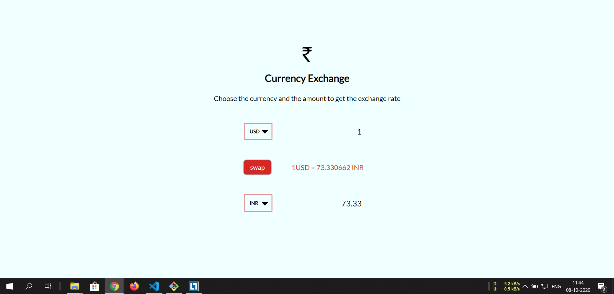

# Currency Exchange
Check the currency rate of different countries.
<br>
<br>
</img>
<br>
_____________________________
## Description
>By fetching data from Open-Source Api , Returns the currency rate for currency , User can compare the rate.
Project to learn about Json and fetch .
_______________________________
## Api Reference
>Open source api exchangerate-api 
```
https://api.exchangerate-api.com/v4/latest/USD
```

